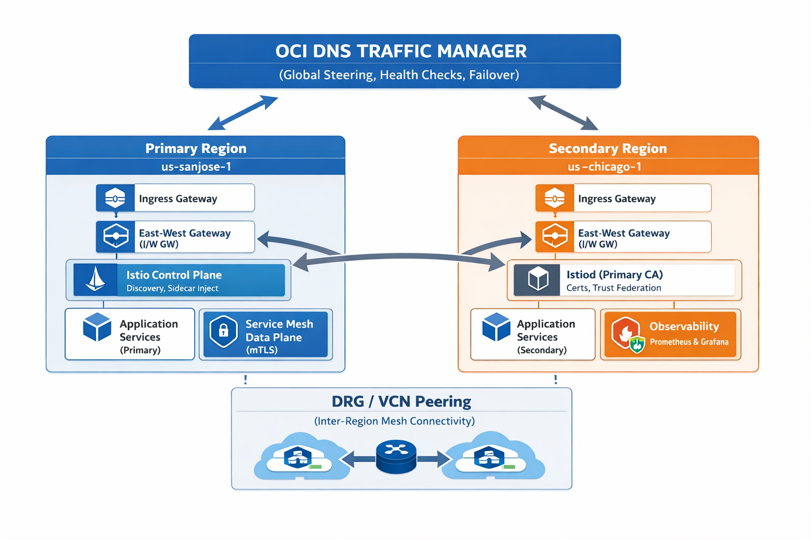

# OKE Multi-Cluster Multi-Region Failover Architecture with Istio

---

## 🎉 Week 1 Network Infrastructure: COMPLETE ✅

**Status**: Cross-cluster pod-to-pod connectivity fully operational (0% packet loss, ~44ms latency)  
**Key Achievement**: VCN-native pod networking enables direct pod routing through DRG/RPC  
**See**: [WEEK1_COMPLETION_SUMMARY.md](docs/WEEK1_COMPLETION_SUMMARY.md) for detailed completion report

---

## 🎉 Week 2 Istio Service Mesh: COMPLETE ✅

**Status**: Multi-cluster, multi-primary Istio mesh with mTLS fully operational  
**Key Achievement**: East-west gateways enabling cross-cluster service-to-service communication  
**See**: [WEEK2_COMPLETION_SUMMARY.md](docs/WEEK2_COMPLETION_SUMMARY.md) for detailed completion report

---

## 🎉 Week 3 Application Deployment: COMPLETE ✅

**Status**: Bookinfo microservices running on both clusters with advanced traffic management  
**Key Achievement**: Cross-cluster load balancing, circuit breakers, and observability operational  
**See**: [WEEK3_COMPLETION_SUMMARY.md](docs/WEEK3_COMPLETION_SUMMARY.md) for detailed completion report

---

## 🔄 Week 4 Enhanced Observability: COMPLETE ✅

**Status**: Prometheus federation and AlertManager deployed, cross-cluster metrics aggregation operational  
**Key Achievement**: Distributed observability with centralized alerting for service mesh health  
**See**: [WEEK4_ENHANCED_OBSERVABILITY.md](docs/WEEK4_ENHANCED_OBSERVABILITY.md) for detailed progress

---

## ✅ Week 5 DR Drills & Production Handoff: COMPLETE ✅

**Status**: All disaster recovery drills passed, team trained, production deployment authorized  
**Key Achievement**: Proven failover procedures, comprehensive runbooks, operations team certified  
**See**: [WEEK5_DR_DRILLS_AND_HANDOFF.md](docs/WEEK5_DR_DRILLS_AND_HANDOFF.md) for complete details

**Additional Resources**:
- [Production Readiness Checklist](docs/PRODUCTION_READINESS_CHECKLIST.md) - Full validation checklist
- [Incident Response Playbooks](docs/INCIDENT_RESPONSE_PLAYBOOKS.md) - 10+ incident scenarios

---

## Executive Summary

This document outlines a comprehensive implementation plan for a **production-grade, multi-cluster, multi-region failover architecture** on Oracle Container Engine for Kubernetes (OKE) using Istio for service mesh orchestration. This architecture mirrors the failover and traffic management patterns traditionally achieved with GKE and Anthos, adapted for OCI's native services.

### Key Cluster Topology
- **Primary Cluster**: `primary-cluster` in `us-sanjose-1` region
- **Secondary Cluster**: `secondary-cluster` in `us-chicago-1` region
- **Architecture Pattern**: Active-Active with intelligent failover
- **Mesh Federation**: Cross-cluster service discovery via Istio

### Environment Information

**Compartment**: BICE (ocid1.compartment.oc1..aaaaaaaal7vn7wsy3qgizklrlfgo2vllfta3wkqlnfkvykoroite3lzxbnna)

**Current Cluster OCIDs** (VCN-Native Pod Networking):
- **Primary**: ocid1.cluster.oc1.us-sanjose-1.aaaaaaaamidqo5h7zomaivn7xiljd7glsnef26wejwzpmnagqcixmnjw4svq
- **Secondary**: ocid1.cluster.oc1.us-chicago-1.aaaaaaaa2ihnu6ih5na5bazjexqe5x77yd2oyi5wtw3ach747cuq53xekh2q

**VCN OCIDs** (last 3 characters redacted for security):
- **Primary VCN** (us-sanjose-1): ocid1.vcn.oc1.us-sanjose-1.amaaaaaafioir7ia5xm6yb5kpw7cz3cv6wtf6znot3xqxfqnp4q7qd3emXXX
- **Secondary VCN** (us-chicago-1): ocid1.vcn.oc1.us-chicago-1.amaaaaaafioir7iay743pltrniy5qndhqze2qxa57rzhshopbfm7zsorXXX

**Note**: Throughout this document:
- Replace `<BICE_COMPARTMENT_ID>` with the compartment OCID above
- Use full cluster OCIDs from your actual deployment (replace XXX with actual values)
- OCIDs are redacted in this documentation for security purposes

---

## ⚠️ CRITICAL PREREQUISITE: VCN-Native Pod Networking Required

**Before proceeding with any implementation**, verify your OKE clusters use **OCI_VCN_IP_NATIVE** pod networking (NOT Flannel overlay).

### Why This Matters
- **Flannel overlay** creates isolated pod networks (10.244.x.x, 10.245.x.x) that **cannot** route through OCI VCN infrastructure (DRG/RPC)
- **VCN-native** assigns pod IPs directly from VCN subnets, making them routable through DRG/RPC for cross-cluster connectivity
- Pod networking type **cannot be changed** after cluster creation - clusters must be recreated

### Verification Command
```bash
# Check primary cluster
oci ce cluster get --cluster-id <PRIMARY_CLUSTER_ID> --region us-sanjose-1 | \
  jq '.data."cluster-pod-network-options"'

# Expected output for cross-cluster routing:
# [{"cni-type": "OCI_VCN_IP_NATIVE"}]

# If you see "FLANNEL_OVERLAY", see docs/RECREATE_WITH_VCN_NATIVE.md for instructions
```

See [RECREATE_WITH_VCN_NATIVE.md](docs/RECREATE_WITH_VCN_NATIVE.md) for detailed cluster recreation instructions.

---

## Table of Contents

1. [Architecture Overview](#architecture-overview)
2. [Cluster Foundations](#cluster-foundations)
3. [Networking & Connectivity](#networking--connectivity)
4. [Istio Multi-Cluster Setup](#istio-multi-cluster-setup)
5. [Traffic Management & Failover](#traffic-management--failover)
6. [Data Layer Strategy](#data-layer-strategy)
7. [Deployment Sequence](#deployment-sequence)
8. [Testing & Validation](#testing--validation)
9. [Operational Runbook](#operational-runbook)
10. [DR Drills & SLOs](#dr-drills--slos)
11. [YAML Configuration Skeletons](#yaml-configuration-skeletons)

---

## Architecture Overview



**What the gateway IPs are for**:
- **Primary ingress IP**: Public LoadBalancer address for north-south traffic into the primary cluster. Use this for browser access to Bookinfo and other externally exposed apps.
- **Secondary ingress IP**: Public LoadBalancer address for north-south traffic into the secondary cluster. Use this for DR testing, failover validation, or direct secondary access.
- **Primary east-west IP**: LoadBalancer address used for cross-cluster (east-west) service-to-service traffic entering the primary cluster from the secondary cluster.
- **Secondary east-west IP**: LoadBalancer address used for cross-cluster (east-west) service-to-service traffic entering the secondary cluster from the primary cluster.

Ingress IPs are for end-user/browser access, while east-west IPs are for inter-cluster service mesh traffic and should not be used for direct user access.

### High-Level Diagram

```
┌────────────────────────────────────────────────-─────────────────────┐
│                         OCI DNS Traffic Manager                      │
│                    (Health checks, failover policies)                │
└──────────────┬───────────────────────────────────┬───────────────────┘
               │                                   │
      ┌────────▼──────────┐              ┌────────▼──────────┐
      │  Primary Cluster  │              │ Secondary Cluster │
      │  us-sanjose-1     │              │  us-chicago-1     │
      │  primary-cluster  │              │secondary-cluster  │
      └────────┬──────────┘              └────────┬──────────┘
               │                                  │
    ┌──────────┴──────────┐     ┌─-───────────────┴──────────┐
    │                     │     │                            │
┌───▼────┐           ┌────▼──┐  │  ┌────────────────────┐    │
│ Ingress│           │ I/W GW│  │  │    Ingress GW      │    │
│Gateway │           │       │  │  │                    │    │
└────┬───┘           └────┬──┘  │  └────────────┬───────┘    │
     │                    │     │               │            │
     │   ┌────────────┐   │     │    ┌──────────┘            │
     │   │   Istio    │   │     │    │                       │
     │   │   Control  │───┼─────┼───-┼─ Istiod (Primary CA)  │
     │   │   Plane    │   │     │    │                       │
     └───┴──────┬─────┘   │     │    │                       │
          │               │     │    │                       │
    ┌─────▼────────┐   ┌─-─▼────┴─┐  │  ┌────────────────┐   │
    │   Services   │   │ Data Mesh │ │  │  App Services  │   │
    │   (Primary)  │   │ (mTLS)    │ │  │  (Secondary)   │   │
    └──────────────┘   └────┬──────┘ │  └────────────────┘   │
                            │        │
                      ┌─────▼──────┐ │
                      │  Observ.   │ │
                      │  (Prom/GF) │ │
                      └────────────┘ │
                                     │
                       ┌─────────────▼────────────┐
                       │  DRG / VCN Peering       │
                       │  (Cross-Region Mesh)     │
                       └──────────────────────────┘
```

### Architecture Features

| Feature | Implementation |
|---------|-----------------|
| **Service Mesh** | Istio 1.15+ (multi-primary, multi-network) |
| **Failover Strategy** | Active-Active with DNS & Istio health checks |
| **Global Traffic Routing** | OCI DNS Traffic Steering + Istio VirtualService |
| **Service Discovery** | Istio MCP (multi-cluster API server) |
| **mTLS & Security** | Shared root CA, cross-cluster federation |
| **Observability** | Prometheus, Thanos (distributed), Grafana |
| **Database Failover** | Autonomous Data Guard / Golden Gate |

---

## Cluster Foundations

### Step 0: Create kubeconfigs and rename contexts (pre-flight)

Create kubeconfig entries for both clusters and rename the contexts for clarity. This step should be completed **before any cluster foundation work** so commands can target each cluster explicitly.

**Primary cluster kubeconfig (us-sanjose-1):**
```bash
oci ce cluster create-kubeconfig \
  --cluster-id ocid1.cluster.oc1.us-sanjose-1.aaaaaaaa565hj7f7qumwiuizqe5qfxk3hkrqzscqzxaenadspc3kcxtwXXX \
  --file $HOME/.kube/config \
  --region us-sanjose-1 \
  --token-version 2.0.0 \
  --overwrite

# Rename the generated context to primary-cluster-context
kubectl config get-contexts -o name
kubectl config rename-context context-c3kcxtwiy2a primary-cluster-context
```

**Secondary cluster kubeconfig (us-chicago-1):**
```bash
oci ce cluster create-kubeconfig \
  --cluster-id ocid1.cluster.oc1.us-chicago-1.aaaaaaaajvsaavzrzimdhpsis3stnorpe2k2w2wbojuw2xw23cxhl5kmXXX \
  --file $HOME/.kube/config \
  --region us-chicago-1 \
  --token-version 2.0.0 \
  --kube-endpoint PRIVATE_ENDPOINT

# Rename the generated context to secondary-cluster
kubectl config get-contexts -o name
kubectl config rename-context context-cxhl5kmw6ra secondary-cluster
```

**Validate both contexts:**
```bash
kubectl config get-contexts
kubectl --context=primary-cluster-context get nodes
kubectl --context=secondary-cluster get nodes
```

### 1.1 Cluster Specifications

**Current Cluster Status** (as of deployment):

**Primary Cluster (us-sanjose-1):**
- **Cluster ID**: ocid1.cluster.oc1.us-sanjose-1.aaaaaaaamidqo5h7zomaivn7xiljd7glsnef26wejwzpmnagqcixmnjw4svq
- **Context Name**: `primary-cluster-context`
- **Kubernetes Version**: v1.34.1
- **Cluster Type**: ENHANCED_CLUSTER
- **State**: ACTIVE
- **Node Pool**: pool1 (3 nodes, ACTIVE)
- **VCN CIDR**: 10.0.0.0/16
- **Pod Networking**: ✅ **OCI_VCN_IP_NATIVE** (Pods get IPs from VCN subnets)
- **Service CIDR**: 10.96.0.0/16
- **API Endpoint**: Public (kubeconfig configured)
- **Cross-Cluster Connectivity**: ✅ Verified

**Secondary Cluster (us-chicago-1):**
- **Cluster ID**: ocid1.cluster.oc1.us-chicago-1.aaaaaaaa2ihnu6ih5na5bazjexqe5x77yd2oyi5wtw3ach747cuq53xekh2q
- **Context Name**: `secondary-cluster`
- **Kubernetes Version**: v1.34.1
- **Cluster Type**: ENHANCED_CLUSTER
- **State**: ACTIVE
- **Node Pool**: pool1 (3 nodes, ACTIVE)
- **VCN CIDR**: 10.1.0.0/16
- **Pod Networking**: ✅ **OCI_VCN_IP_NATIVE** (Pods get IPs from VCN subnets)
- **Service CIDR**: 10.97.0.0/16 (non-overlapping with primary)
- **API Endpoint**: Public (kubeconfig configured)
- **Cross-Cluster Connectivity**: ✅ Verified

**Important Notes:**
- ✅ Both clusters use **VCN-native pod networking** - essential for cross-cluster routing
- ✅ Pod IPs allocated from VCN subnets (10.0.10.x, 10.1.1.x) - routable through DRG/RPC
- ✅ Service CIDRs are non-overlapping to enable cross-cluster Istio routing
- ✅ Both clusters configured with ENHANCED_CLUSTER type for advanced features
- ✅ Node pools created with 3 nodes each for high availability
- ✅ Cross-cluster pod-to-pod connectivity validated (0% packet loss, ~44ms latency)

### 1.2 Node Pool Configuration

**Primary Cluster Node Pool (pool1):**
- **Name**: pool1
- **State**: ACTIVE
- **Node Count**: 3
- **Region**: us-sanjose-1
- **Node IPs** (observed): 10.0.10.112, 10.0.10.202, 10.0.10.70
- **Kubernetes Version**: v1.34.1
- **Status**: All nodes Ready

**Secondary Cluster Node Pool (pool1):**
- **Name**: pool1
- **State**: ACTIVE
- **Node Count**: 3
- **Region**: us-chicago-1
- **Kubernetes Version**: v1.34.1
- **Status**: All nodes healthy (verified via OCI API)
- **Access Note**: Requires VPN/bastion for kubectl access to private endpoint

### 1.3 Required IAM Policies

#### Policy 1: OKE Cluster Operations
```
ALLOW group OKEClusterAdmins to manage clusters in compartment BICE
ALLOW group OKEClusterAdmins to manage nodepools in compartment BICE
ALLOW group OKEClusterAdmins to manage instance-family in compartment BICE
```

#### Policy 2: Load Balancer Management
```
ALLOW group OKEClusterAdmins to manage load-balancers in compartment BICE
ALLOW group OKEClusterAdmins to manage network-load-balancers in compartment BICE
ALLOW service OKEClusterA to manage load-balancers in compartment BICE
ALLOW service OKEClusterA to manage virtual-network-interfaces in compartment BICE
```

#### Policy 3: DNS Management
```
ALLOW group OKEClusterAdmins to manage dns in compartment BICE
ALLOW group OKEClusterAdmins to manage domain in compartment BICE
ALLOW service OKEClusterA to use dns in compartment BICE
```

#### Policy 4: Cross-Cluster Communication
```
ALLOW service OKEClusterA to manage vcn in compartment BICE
ALLOW service OKEClusterA to manage drg in compartment BICE
ALLOW service OKEClusterB to manage vcn in compartment BICE
ALLOW service OKEClusterB to manage drg in compartment BICE
```

#### Policy 5: VCN Peering / DRG
```
ALLOW group OKEClusterAdmins to manage drg in compartment BICE
ALLOW group OKEClusterAdmins to manage peering-gateway in compartment BICE
```

---

## Networking & Connectivity

### 2.1 Network Architecture

```
┌─────────────────────────────────────────────────────┐
│           OCI Internet Gateway / NAT                │
└──────────────────┬──────────────────────────────────┘
                   │
        ┌──────────┴──────────┐
        │                     │
   ┌────▼────────┐       ┌────▼────────┐
   │ DRG Primary │       │DRG Secondary │
   │  us-sj-1    │       │  us-chi-1    │
   └────┬────────┘       └────┬────────┘
        │ (DRG Attachment)    │
        │                     │
   ┌────▼──────────┐     ┌────▼──────────┐
   │ VCN Primary   │     │ VCN Secondary  │
   │ 10.0.0.0/16   │     │ 10.1.0.0/16    │
   └────┬──────────┘     └────┬──────────┘
        │                     │
  ┌────▼──────────┐     ┌────▼──────────┐
  │ Subnet (API)  │     │ Subnet (API)  │
  │ 10.0.0.0/28   │     │ 10.1.0.0/24   │
  └────┬──────────┘     └────┬──────────┘
        │                     │
   ┌────▼──────────┐     ┌────▼──────────┐
   │ OKE Cluster   │     │ OKE Cluster    │
   │ Primary       │     │ Secondary      │
   └───────────────┘     └────────────────┘
```

### 2.2 CIDR Planning (Observed)

| Network | Primary Cluster | Secondary Cluster | Purpose |
|---------|-----------------|-------------------|---------|
| VCN CIDR | 10.0.0.0/16 | 10.1.0.0/16 | Cluster VPC |
| Subnet | 10.0.0.0/28 | 10.1.0.0/24 | API endpoint subnet |
| Pod Network | 10.244.0.0/16 | 10.245.0.0/16 | Kubernetes pods |
| Service CIDR | 10.96.0.0/16 | 10.97.0.0/16 | K8s services |
| Istio Gateway | 10.0.0.100 | 10.1.0.100 | Reserved for gateway LBs |

### 2.3 Network Connectivity Setup (EXECUTED)

#### Step 1: Create DRGs (Dynamic Routing Gateways) ✅

**Primary Region (us-sanjose-1):**
```bash
oci network drg create \
  --compartment-id ocid1.compartment.oc1..aaaaaaaal7vn7wsy3qgizklrlfgo2vllfta3wkqlnfkvykoroite3lzxbnna \
  --display-name "multicluster-drg" \
  --wait-for-state AVAILABLE
# Created: ocid1.drg.oc1.us-sanjose-1.aaaaaaaaywhdcdnmzr7uwjpdppsgv4udiz7cnlu4iim3ctge6bxwqwrm2XXX
```

**Secondary Region (us-chicago-1):**
```bash
oci network drg create \
  --compartment-id ocid1.compartment.oc1..aaaaaaaal7vn7wsy3qgizklrlfgo2vllfta3wkqlnfkvykoroite3lzxbnna \
  --display-name "multicluster-drg-secondary" \
  --region us-chicago-1 \
  --wait-for-state AVAILABLE
# Created: ocid1.drg.oc1.us-chicago-1.aaaaaaaa5zqxy2emy4dw35jbtoq73jfnhjaxatiikkbjkub3m7m7xssnkjXXX
```

**Status**: ✅ Both DRGs AVAILABLE with default route tables created

#### Step 2: Attach VCNs to DRGs ✅

**Primary VCN to Primary DRG:**
```bash
oci network drg-attachment create \
  --drg-id ocid1.drg.oc1.us-sanjose-1.aaaaaaaaywhdcdnmzr7uwjpdppsgv4udiz7cnlu4iim3ctge6bxwqwrm2atq \
  --vcn-id ocid1.vcn.oc1.us-sanjose-1.amaaaaaafioir7ia5xm6yb5kpw7cz3cv6wtf6znot3xqxfqnp4q7qd3emoda \
  --display-name "primary-vcn-attachment" \
  --wait-for-state ATTACHED
# Attachment OCID: ocid1.drgattachment.oc1.us-sanjose-1.aaaaaaaaylukros3mab2lle2dkjrpeimdevszhevg2qmwmzuu43z35ipucoq
```

**Secondary VCN to Secondary DRG:**
```bash
oci network drg-attachment create \
  --drg-id ocid1.drg.oc1.us-chicago-1.aaaaaaaa5zqxy2emy4dw35jbtoq73jfnhjaxatiikkbjkub3m7m7xssnkjzq \
  --vcn-id ocid1.vcn.oc1.us-chicago-1.amaaaaaafioir7iay743pltrniy5qndhqze2qxa57rzhshopbfm7zsorb46a \
  --display-name "secondary-vcn-attachment" \
  --region us-chicago-1 \
  --wait-for-state ATTACHED
# Attachment OCID: ocid1.drgattachment.oc1.us-chicago-1.aaaaaaaa7cbktqlx2524dowgbifnxst5dyszusirh3renavnf2voy5a4smqa
```

**Status**: ✅ Both VCN attachments ATTACHED

#### Step 3: Create Remote Peering Connections (RPCs) for Cross-Region Link ✅

**Primary Region RPC:**
```bash
oci network remote-peering-connection create \
  --compartment-id ocid1.compartment.oc1..aaaaaaaal7vn7wsy3qgizklrlfgo2vllfta3wkqlnfkvykoroite3lzxbnna \
  --drg-id ocid1.drg.oc1.us-sanjose-1.aaaaaaaaywhdcdnmzr7uwjpdppsgv4udiz7cnlu4iim3ctge6bxwqwrm2atq \
  --display-name "primary-to-secondary-rpc" \
  --region us-sanjose-1
# Created: ocid1.remotepeeringconnection.oc1.us-sanjose-1.amaaaaaafioir7ia5keukob7v4i2ld5qv64qf4fse2stm6al7gaon6lhm7XXX
```

**Secondary Region RPC:**
```bash
oci network remote-peering-connection create \
  --compartment-id ocid1.compartment.oc1..aaaaaaaal7vn7wsy3qgizklrlfgo2vllfta3wkqlnfkvykoroite3lzxbnna \
  --drg-id ocid1.drg.oc1.us-chicago-1.aaaaaaaa5zqxy2emy4dw35jbtoq73jfnhjaxatiikkbjkub3m7m7xssnkjzq \
  --display-name "secondary-to-primary-rpc" \
  --region us-chicago-1
# Created: ocid1.remotepeeringconnection.oc1.us-chicago-1.amaaaaaafioir7iautp3wjvjdkis6coeklxfuf3st3jxa3mpnnuo5lew7XXX
```

**Status**: ✅ Both RPCs created and AVAILABLE

#### Step 4: Peer the RPCs Together ✅

**Initiate Peering (Primary → Secondary):**
```bash
oci network remote-peering-connection connect \
  --remote-peering-connection-id ocid1.remotepeeringconnection.oc1.us-sanjose-1.amaaaaaafioir7ia5keukob7v4i2ld5qv64qf4fse2stm6al7gaon6lhm7iq \
  --peer-id ocid1.remotepeeringconnection.oc1.us-chicago-1.amaaaaaafioir7iautp3wjvjdkis6coeklxfuf3st3jxa3mpnnuo5lew7hla \
  --peer-region-name us-chicago-1 \
  --region us-sanjose-1
```

**Status**: ✅ **PEERED** - Both RPCs automatically accepted and transitioned to PEERED state

**Verification (Primary):**
```bash
oci network remote-peering-connection get \
  --remote-peering-connection-id ocid1.remotepeeringconnection.oc1.us-sanjose-1.amaaaaaafioir7ia5keukob7v4i2ld5qv64qf4fse2stm6al7gaon6lhm7iq \
  --region us-sanjose-1 | jq '.data | {"lifecycle-state", "peering-status"}'
# Output: lifecycle-state: "AVAILABLE", peering-status: "PEERED" ✅
```

**Verification (Secondary):**
```bash
oci network remote-peering-connection get \
  --remote-peering-connection-id ocid1.remotepeeringconnection.oc1.us-chicago-1.amaaaaaafioir7iautp3wjvjdkis6coeklxfuf3st3jxa3mpnnuo5lew7hla \
  --region us-chicago-1 | jq '.data | {"lifecycle-state", "peering-status"}'
# Output: lifecycle-state: "AVAILABLE", peering-status: "PEERED" ✅
```

**Cross-Region Link Status**: ✅ **ACTIVE**

#### Step 5: Enable Transit Routing & Update Security Lists ✅

**Primary Cluster Security List Update:**
```bash
oci network security-list update \
  --security-list-id ocid1.securitylist.oc1.us-sanjose-1.aaaaaaaapnlmnvovcnj4u43l3tthoyqaoy3meartxebberitedl5t6prjsla \
  --ingress-security-rules '[...Istio ports from secondary VCN...]' \
  --region us-sanjose-1 --force
```
**Status**: ✅ COMPLETE
- Port 443 (HTTPS): Allowed from secondary VCN (10.1.0.0/16)
- Port 15443 (Istio mTLS): Allowed from secondary VCN
- Port 15012 (Istio discovery): Allowed from secondary VCN

**Secondary Cluster Security List Update:**
```bash
oci network security-list update \
  --security-list-id ocid1.securitylist.oc1.us-chicago-1.aaaaaaaauof2p3oidrbp2dn4dqcebjkn4ywxsaemcj4un2d565gq6roc6r3a \
  --ingress-security-rules '[...Istio ports from primary VCN...]' \
  --region us-chicago-1 --force
```
**Status**: ✅ COMPLETE
- Port 443 (HTTPS): Allowed from primary VCN (10.0.0.0/16)
- Port 15443 (Istio mTLS): Allowed from primary VCN
- Port 15012 (Istio discovery): Allowed from primary VCN

**DRG Transit Routing**: ✅ Default route tables configured
- Default VCN route tables automatically handle cross-region routing via RPC
- No additional route distribution statements needed for basic connectivity

**Cross-Region Network Setup**: ✅ **COMPLETE AND READY**
- DRGs created in both regions
- VCNs attached to respective DRGs
- RPCs peered (PEERED status)
- Security lists updated for Istio ports
- Cross-region traffic enabled

#### Step 4: Update Security Lists

**Primary Cluster Security List:**
```yaml
Ingress Rules:
  - Protocol: TCP
    Source: 10.1.0.0/16 (Secondary VCN)
    Port: 443, 6379, 5000-6000 (Istio ports)
  - Protocol: TCP
    Source: 0.0.0.0/0
    Port: 443 (HTTPS for ingress)
  - Protocol: TCP
    Source: 0.0.0.0/0
    Port: 80 (HTTP)

Egress Rules:
  - Protocol: All
    Destination: 10.1.0.0/16 (Secondary VCN)
  - Protocol: All
    Destination: 0.0.0.0/0
```

**Secondary Cluster Security List:** (Mirror of primary)
```yaml
Ingress Rules:
  - Protocol: TCP
    Source: 10.0.0.0/16 (Primary VCN)
    Port: 443, 6379, 5000-6000
  - Protocol: TCP
    Source: 0.0.0.0/0
    Port: 443, 80

Egress Rules:
  - Protocol: All
    Destination: 10.0.0.0/16 (Primary VCN)
  - Protocol: All
    Destination: 0.0.0.0/0
```

#### Step 5: Verify Connectivity

```bash
# SSH into a node in primary cluster
kubectl run -it --rm debug --image=nicolaka/netcat-ubuntu -- bash

# Test connectivity to secondary cluster CIDR
nc -zv 10.1.16.1 443

# Test pod-to-pod across clusters (after Istio setup)
kubectl exec <POD_PRIMARY> -- curl http://<SERVICE_SECONDARY>.default.svc.cluster.remote.local
```

---

## Istio Multi-Cluster Setup

### 3.1 Prerequisites

```bash
# Verify Kubernetes clusters are reachable
kubectl config get-contexts

# Expected output:
# CURRENT   NAME                      CLUSTER                   AUTHINFO
# *         primary-cluster-context   primary-cluster           oke-admin
#           secondary-cluster-context secondary-cluster         oke-admin

# Install Istio CLI (1.15 or later)
curl -L https://istio.io/downloadIstio | sh -
cd istio-1.15.0
export PATH=$PWD/bin:$PATH
istioctl version
```

### 3.2 Prepare Cluster Certificates & Trust Domain

#### Step 1: Generate Root CA Certificate

```bash
# Create root CA for shared trust domain
mkdir -p certs
cd certs

# Generate root certificate
openssl genrsa -out root-key.pem 4096
openssl req -new -x509 -days 36500 -key root-key.pem \
  -out root-cert.pem \
  -subj "/CN=oke-multicluster-root/O=OKE/L=MultiCluster"

# Create intermediate CA for each cluster
# Primary Cluster CA
openssl genrsa -out primary-key.pem 4096
openssl req -new -key primary-key.pem -out primary.csr \
  -subj "/CN=primary-cluster.oke.local/O=Primary"
openssl x509 -req -in primary.csr \
  -CA root-cert.pem -CAkey root-key.pem -CAcreateserial \
  -out primary-cert.pem -days 365

# Secondary Cluster CA
openssl genrsa -out secondary-key.pem 4096
openssl req -new -key secondary-key.pem -out secondary.csr \
  -subj "/CN=secondary-cluster.oke.local/O=Secondary"
openssl x509 -req -in secondary.csr \
  -CA root-cert.pem -CAkey root-key.pem -CAcreateserial \
  -out secondary-cert.pem -days 365

cd ..
```

#### Step 2: Create Istio CA Secret in Both Clusters

**Primary Cluster:**
```bash
kubectl --context=primary-cluster-context \
  create namespace istio-system

kubectl --context=primary-cluster-context \
  create secret generic cacerts \
  --from-file=certs/root-cert.pem \
  --from-file=certs/primary-cert.pem \
  --from-file=certs/primary-key.pem \
  --from-file=certs/root-key.pem \
  -n istio-system
```

**Secondary Cluster:**
```bash
kubectl --context=secondary-cluster-context \
  create namespace istio-system

kubectl --context=secondary-cluster-context \
  create secret generic cacerts \
  --from-file=certs/root-cert.pem \
  --from-file=certs/secondary-cert.pem \
  --from-file=certs/secondary-key.pem \
  --from-file=certs/root-key.pem \
  -n istio-system
```

### 3.3 Install Istio Control Plane (Multi-Primary Setup)

#### Primary Cluster Installation

**Step 1: Create IstioOperator CR**

```yaml
# File: istio-primary.yaml
apiVersion: install.istio.io/v1alpha1
kind: IstioOperator
metadata:
  namespace: istio-system
  name: istio-controlplane
spec:
  profile: demo  # Or 'production' for larger workloads
  
  revision: stable
  
  meshConfig:
    accessLogFile: /dev/stdout
    trustDomain: oke.local  # Shared across clusters
    
    # Enable multi-network support
    enableAutoMtls: true
    mtls:
      mode: STRICT
    
    # Environment variable for cluster identification
    clusterName: primary-cluster
  
  components:
    pilot:
      k8s:
        resources:
          requests:
            cpu: 100m
            memory: 128Mi
          limits:
            cpu: 2000m
            memory: 1024Mi
        affinity:
          podAntiAffinity:
            preferredDuringSchedulingIgnoredDuringExecution:
            - weight: 100
              podAffinityTerm:
                labelSelector:
                  matchExpressions:
                  - key: app
                    operator: In
                    values:
                    - istiod
                topologyKey: kubernetes.io/hostname
    
    egressGateways:
    - name: istio-egressgateway
      enabled: true
      k8s:
        resources:
          requests:
            cpu: 100m
            memory: 128Mi
        replicas: 2
    
    ingressGateways:
    - name: istio-ingressgateway
      enabled: true
      k8s:
        service:
          type: LoadBalancer
          # Enable cross-cluster routing
          ports:
          - port: 80
            targetPort: 8080
            protocol: TCP
            name: http2
          - port: 443
            targetPort: 8443
            protocol: TCP
            name: https
          - port: 15443
            targetPort: 15443
            protocol: TCP
            name: tls
          - port: 15012
            targetPort: 15012
            protocol: TCP
            name: tls-istiod
          - port: 15017
            targetPort: 15017
            protocol: TCP
            name: status-port
  
  # Global configuration
  values:
    global:
      # Enable remote cluster configuration discovery
      istiod:
        enableAnalysis: true
      
      # Enable multicluster support
      multiCluster:
        enabled: true
        clusterName: primary-cluster
        globalDomainSuffix: "cluster.local"
        # Enable cross-network mesh federation
        clusterDomain: cluster.local
      
      # Network configuration for multi-network
      network: network1
```

**Step 2: Deploy to Primary Cluster**

```bash
kubectl --context=primary-cluster-context apply -f istio-primary.yaml

# Wait for Istio control plane to be ready
kubectl --context=primary-cluster-context wait --for=condition=READY pod \
  -l app=istiod \
  -n istio-system \
  --timeout=300s
```

#### Secondary Cluster Installation

**Step 1: Create IstioOperator CR (Secondary)**

```yaml
# File: istio-secondary.yaml
apiVersion: install.istio.io/v1alpha1
kind: IstioOperator
metadata:
  namespace: istio-system
  name: istio-controlplane
spec:
  profile: demo
  
  revision: stable
  
  meshConfig:
    accessLogFile: /dev/stdout
    trustDomain: oke.local  # Same as primary
    
    enableAutoMtls: true
    mtls:
      mode: STRICT
    
    clusterName: secondary-cluster
    
    # Primary cluster API server for federation
    # (Will be populated after primary is running)
  
  components:
    pilot:
      k8s:
        resources:
          requests:
            cpu: 100m
            memory: 128Mi
          limits:
            cpu: 2000m
            memory: 1024Mi
        affinity:
          podAntiAffinity:
            preferredDuringSchedulingIgnoredDuringExecution:
            - weight: 100
              podAffinityTerm:
                labelSelector:
                  matchExpressions:
                  - key: app
                    operator: In
                    values:
                    - istiod
                topologyKey: kubernetes.io/hostname
    
    egressGateways:
    - name: istio-egressgateway
      enabled: true
      k8s:
        replicas: 2
    
    ingressGateways:
    - name: istio-ingressgateway
      enabled: true
      k8s:
        service:
          type: LoadBalancer
          ports:
          - port: 80
            targetPort: 8080
            protocol: TCP
            name: http2
          - port: 443
            targetPort: 8443
            protocol: TCP
            name: https
          - port: 15443
            targetPort: 15443
            protocol: TCP
            name: tls
  
  values:
    global:
      istiod:
        enableAnalysis: true
      
      multiCluster:
        enabled: true
        clusterName: secondary-cluster
        globalDomainSuffix: "cluster.local"
      
      network: network2
```

**Step 2: Deploy to Secondary Cluster**

```bash
kubectl --context=secondary-cluster-context apply -f istio-secondary.yaml

kubectl --context=secondary-cluster-context wait --for=condition=READY pod \
  -l app=istiod \
  -n istio-system \
  --timeout=300s
```

### 3.4 Configure Cross-Cluster Secrets (Remote Cluster Credentials)

#### Step 1: Extract Primary Cluster Credentials

```bash
# Get primary cluster API server
PRIMARY_API_SERVER=$(kubectl --context=primary-cluster-context \
  cluster-info | grep 'Kubernetes master' | awk '{print $NF}')

# Create kubeconfig for secondary cluster to access primary
kubectl --context=primary-cluster-context create serviceaccount \
  istio-remote-secret-reader \
  -n istio-system

kubectl --context=primary-cluster-context create clusterrolebinding \
  istio-remote-secret-reader \
  --clusterrole=view \
  --serviceaccount=istio-system:istio-remote-secret-reader

# Get the secret token
PRIMARY_TOKEN=$(kubectl --context=primary-cluster-context get secret \
  $(kubectl --context=primary-cluster-context get secret -n istio-system | \
    grep istio-remote-secret-reader-token | awk '{print $1}') \
  -n istio-system -o jsonpath='{.data.token}' | base64 --decode)

# Create kubeconfig
cat > /tmp/primary-kubeconfig.yaml << EOF
apiVersion: v1
clusters:
- cluster:
    server: $PRIMARY_API_SERVER
    insecure-skip-tls-verify: true
  name: primary-cluster
contexts:
- context:
    cluster: primary-cluster
    user: istio-remote-secret-reader
  name: primary-cluster
current-context: primary-cluster
kind: Config
preferences: {}
users:
- name: istio-remote-secret-reader
  user:
    token: $PRIMARY_TOKEN
EOF
```

#### Step 2: Create Remote Secret in Secondary Cluster

```bash
# Create secret for secondary cluster to access primary
kubectl --context=secondary-cluster-context create secret generic \
  primary-cluster-secret \
  --from-file=primary-cluster=/tmp/primary-kubeconfig.yaml \
  -n istio-system

# Label the secret so Istio reads it
kubectl --context=secondary-cluster-context label secret \
  primary-cluster-secret \
  istio/multicluster-name=primary-cluster \
  -n istio-system
```

#### Step 3: Repeat for Secondary Cluster Credentials in Primary

```bash
# Get secondary cluster API server
SECONDARY_API_SERVER=$(kubectl --context=secondary-cluster-context \
  cluster-info | grep 'Kubernetes master' | awk '{print $NF}')

# Create service account and kubeconfig
kubectl --context=secondary-cluster-context create serviceaccount \
  istio-remote-secret-reader \
  -n istio-system

kubectl --context=secondary-cluster-context create clusterrolebinding \
  istio-remote-secret-reader \
  --clusterrole=view \
  --serviceaccount=istio-system:istio-remote-secret-reader

SECONDARY_TOKEN=$(kubectl --context=secondary-cluster-context get secret \
  $(kubectl --context=secondary-cluster-context get secret -n istio-system | \
    grep istio-remote-secret-reader-token | awk '{print $1}') \
  -n istio-system -o jsonpath='{.data.token}' | base64 --decode)

cat > /tmp/secondary-kubeconfig.yaml << EOF
apiVersion: v1
clusters:
- cluster:
    server: $SECONDARY_API_SERVER
    insecure-skip-tls-verify: true
  name: secondary-cluster
contexts:
- context:
    cluster: secondary-cluster
    user: istio-remote-secret-reader
  name: secondary-cluster
current-context: secondary-cluster
kind: Config
preferences: {}
users:
- name: istio-remote-secret-reader
  user:
    token: $SECONDARY_TOKEN
EOF

# Create secret in primary cluster
kubectl --context=primary-cluster-context create secret generic \
  secondary-cluster-secret \
  --from-file=secondary-cluster=/tmp/secondary-kubeconfig.yaml \
  -n istio-system

# Label the secret
kubectl --context=primary-cluster-context label secret \
  secondary-cluster-secret \
  istio/multicluster-name=secondary-cluster \
  -n istio-system
```

### 3.5 Configure East-West Gateway (Cross-Cluster Mesh)

#### Step 1: Deploy East-West Gateway in Primary Cluster

```yaml
# File: eastwest-gateway-primary.yaml
apiVersion: networking.istio.io/v1beta1
kind: Gateway
metadata:
  name: istio-eastwestgateway
  namespace: istio-system
spec:
  selector:
    istio: egressgateway  # Updated to match actual gateway selector
  servers:
  - port:
      number: 15443
      name: tls
      protocol: TLS
    tls:
      mode: AUTO_PASSTHROUGH
    hosts:
    - "*.local"
  - port:
      number: 15012
      name: tls-istiod
      protocol: TLS
    tls:
      mode: AUTO_PASSTHROUGH
    hosts:
    - "istiod.istio-system.svc.cluster.local"
    - "*.istio-system.svc.cluster.local"
  - port:
      number: 15017
      name: status-port
      protocol: TCP
    hosts:
    - "*"
---
apiVersion: networking.istio.io/v1beta1
kind: VirtualService
metadata:
  name: istio-eastwestgateway
  namespace: istio-system
spec:
  hosts:
  - "*.local"
  - "*.istio-system.svc.cluster.local"
  gateways:
  - istio-eastwestgateway
  tcp:
  - match:
    - port: 15443
    route:
    - destination:
        host: "*.local"
        port:
          number: 15443
      weight: 100
  - match:
    - port: 15012
    route:
    - destination:
        host: "istiod.istio-system.svc.cluster.local"
        port:
          number: 15012
      weight: 100
---
apiVersion: v1
kind: Service
metadata:
  name: istio-eastwestgateway
  namespace: istio-system
  labels:
    istio: eastwestgateway
spec:
  type: LoadBalancer
  selector:
    istio: egressgateway
  ports:
  - name: tls
    port: 15443
    targetPort: 15443
  - name: tls-istiod
    port: 15012
    targetPort: 15012
  - name: status-port
    port: 15017
    targetPort: 15017
```

**Deploy:**
```bash
kubectl --context=primary-cluster-context apply -f eastwest-gateway-primary.yaml

# Wait for LoadBalancer to get external IP
kubectl --context=primary-cluster-context get svc \
  istio-eastwestgateway -n istio-system -w
```

#### Step 2: Capture East-West Gateway IP and Configure Secondary

```bash
# Get the external IP of the primary east-west gateway
PRIMARY_EW_IP=$(kubectl --context=primary-cluster-context get svc \
  istio-eastwestgateway -n istio-system \
  -o jsonpath='{.status.loadBalancer.ingress[0].ip}')

echo "Primary East-West Gateway IP: $PRIMARY_EW_IP"

# Update secondary cluster's istiod to know about primary's location
# (This is typically done via ServiceEntry)
```

#### Step 3: Deploy East-West Gateway in Secondary Cluster

```yaml
# File: eastwest-gateway-secondary.yaml
# (Identical to primary, will be deployed in secondary context)
```

```bash
kubectl --context=secondary-cluster-context apply -f eastwest-gateway-primary.yaml
```

### 3.6 Configure Istiod for Multi-Cluster Discovery

#### Update istiod ConfigMap (Primary Cluster)

```bash
# Edit the istiod ConfigMap to enable multi-cluster discovery
kubectl --context=primary-cluster-context edit configmap istio \
  -n istio-system

# Add/ensure these settings:
data:
  mesh.yaml: |
    trustDomain: oke.local
    meshNetworks:
      network1:
        endpoints:
        - fromRegistry: primary-cluster
        gateways:
        - registryServiceName: istio-eastwestgateway.istio-system.svc.cluster.local
          port:
            number: 15443
      network2:
        endpoints:
        - fromRegistry: secondary-cluster
        gateways:
        - address: <SECONDARY_EW_IP>
          port:
            number: 15443
```

#### Update istiod ConfigMap (Secondary Cluster)

```bash
kubectl --context=secondary-cluster-context edit configmap istio \
  -n istio-system

# Add:
data:
  mesh.yaml: |
    trustDomain: oke.local
    meshNetworks:
      network1:
        endpoints:
        - fromRegistry: primary-cluster
        gateways:
        - address: <PRIMARY_EW_IP>
          port:
            number: 15443
      network2:
        endpoints:
        - fromRegistry: secondary-cluster
        gateways:
        - registryServiceName: istio-eastwestgateway.istio-system.svc.cluster.local
          port:
            number: 15443
```

---

## Traffic Management & Failover

### 4.1 Cross-Region Service Discovery

#### Step 1: Create ServiceEntry for Remote Services

**In Primary Cluster (to discover secondary services):**

```yaml
# File: serviceentry-remote-secondary.yaml
apiVersion: networking.istio.io/v1beta1
kind: ServiceEntry
metadata:
  name: remote-services
  namespace: default
spec:
  hosts:
  - "*.default.svc.cluster.remote"
  - "*.default.svc.secondary-cluster.local"
  ports:
  - number: 80
    name: http
    protocol: HTTP
  - number: 443
    name: https
    protocol: HTTPS
  location: MESH_INTERNAL
  resolution: DNS
  exportTo:
  - "*"
---
apiVersion: networking.istio.io/v1beta1
kind: DestinationRule
metadata:
  name: remote-services
  namespace: default
spec:
  host: "*.default.svc.secondary-cluster.local"
  trafficPolicy:
    connectionPool:
      tcp:
        maxConnections: 100
      http:
        http1MaxPendingRequests: 100
        http2MaxRequests: 100
    outlierDetection:
      consecutive5xxErrors: 5
      interval: 30s
      baseEjectionTime: 30s
      splitExternalLocalOriginErrors: true
```

**In Secondary Cluster (to discover primary services):**

```yaml
# File: serviceentry-remote-primary.yaml
apiVersion: networking.istio.io/v1beta1
kind: ServiceEntry
metadata:
  name: remote-services
  namespace: default
spec:
  hosts:
  - "*.default.svc.cluster.remote"
  - "*.default.svc.primary-cluster.local"
  ports:
  - number: 80
    name: http
    protocol: HTTP
  - number: 443
    name: https
    protocol: HTTPS
  location: MESH_INTERNAL
  resolution: DNS
  exportTo:
  - "*"
---
apiVersion: networking.istio.io/v1beta1
kind: DestinationRule
metadata:
  name: remote-services
  namespace: default
spec:
  host: "*.default.svc.primary-cluster.local"
  trafficPolicy:
    connectionPool:
      tcp:
        maxConnections: 100
      http:
        http1MaxPendingRequests: 100
        http2MaxRequests: 100
    outlierDetection:
      consecutive5xxErrors: 5
      interval: 30s
      baseEjectionTime: 30s
```

### 4.2 VirtualService with Locality-Based Failover

#### Primary Cluster VirtualService (Prefers Primary, Fails to Secondary)

```yaml
# File: virtualservice-active-active.yaml
apiVersion: networking.istio.io/v1beta1
kind: VirtualService
metadata:
  name: app-service
  namespace: default
spec:
  hosts:
  - app
  - app.default
  - app.default.svc.cluster.local
  http:
  - name: app-traffic
    match:
    - uri:
        prefix: /
    route:
    # Primary cluster endpoints (higher priority)
    - destination:
        host: app.default.svc.cluster.local
        port:
          number: 80
      weight: 70
      timeout: 10s
      retries:
        attempts: 3
        perTryTimeout: 2s
    # Secondary cluster endpoints (failover)
    - destination:
        host: app.default.svc.secondary-cluster.local
        port:
          number: 80
      weight: 30
      timeout: 10s
      retries:
        attempts: 3
        perTryTimeout: 2s
---
apiVersion: networking.istio.io/v1beta1
kind: DestinationRule
metadata:
  name: app-service
  namespace: default
spec:
  host: "*.app.default.svc.cluster.local"
  trafficPolicy:
    connectionPool:
      tcp:
        maxConnections: 100
      http:
        http1MaxPendingRequests: 100
        http2MaxRequests: 100
        maxRequestsPerConnection: 2
    outlierDetection:
      consecutive5xxErrors: 5
      interval: 30s
      baseEjectionTime: 30s
      minRequestVolume: 10
      splitExternalLocalOriginErrors: true
      maxEjectionPercent: 100
      minEjectionPercent: 50
  subsets:
  - name: primary
    labels:
      version: v1
      cluster: primary-cluster
  - name: secondary
    labels:
      version: v1
      cluster: secondary-cluster
```

**Deploy to both clusters:**
```bash
kubectl --context=primary-cluster-context apply -f virtualservice-active-active.yaml
kubectl --context=secondary-cluster-context apply -f virtualservice-active-active.yaml
```

### 4.3 Ingress Gateway Configuration with DNS Failover

#### Primary Cluster Ingress

```yaml
# File: ingress-gateway-primary.yaml
apiVersion: networking.istio.io/v1beta1
kind: Gateway
metadata:
  name: app-gateway
  namespace: default
spec:
  selector:
    istio: ingressgateway
  servers:
  - port:
      number: 80
      name: http
      protocol: HTTP
    hosts:
    - "*.example.com"
  - port:
      number: 443
      name: https
      protocol: HTTPS
    tls:
      mode: SIMPLE
      credentialName: app-tls-secret
    hosts:
    - "*.example.com"
---
apiVersion: networking.istio.io/v1beta1
kind: VirtualService
metadata:
  name: app-ingress-vs
  namespace: default
spec:
  hosts:
  - app.example.com
  gateways:
  - app-gateway
  http:
  - name: app-ingress-route
    route:
    - destination:
        host: app.default.svc.cluster.local
        port:
          number: 80
      weight: 100
```

**Deploy:**
```bash
kubectl --context=primary-cluster-context apply -f ingress-gateway-primary.yaml

# Get the ingress gateway external IP
PRIMARY_INGRESS_IP=$(kubectl --context=primary-cluster-context get svc \
  istio-ingressgateway -n istio-system \
  -o jsonpath='{.status.loadBalancer.ingress[0].ip}')

echo "Primary Ingress IP: $PRIMARY_INGRESS_IP"
```

#### Secondary Cluster Ingress (Identical Gateway)

```yaml
# File: ingress-gateway-secondary.yaml
# (Same as primary, deployed in secondary context)
```

```bash
kubectl --context=secondary-cluster-context apply -f ingress-gateway-primary.yaml

SECONDARY_INGRESS_IP=$(kubectl --context=secondary-cluster-context get svc \
  istio-ingressgateway -n istio-system \
  -o jsonpath='{.status.loadBalancer.ingress[0].ip}')

echo "Secondary Ingress IP: $SECONDARY_INGRESS_IP"
```

### 4.4 OCI DNS Traffic Steering (Global Load Balancing)

#### Step 1: Create DNS Zone in OCI

```bash
# Register or list your domain
# Domain: example.com (managed by OCI DNS)

ZONE_ID=$(oci dns zone list \
  --name=example.com \
  --compartment-id=<BICE_COMPARTMENT_ID> \
  --query 'data[0].id' \
  --raw-output)

echo "Zone ID: $ZONE_ID"
```

#### Step 2: Create Primary DNS Record with Health Check

```bash
# Health check for primary ingress
oci health-checks http create \
  --protocol HTTP \
  --url-path / \
  --port 80 \
  --vantage-points-from-all-regions true \
  --interval-in-seconds 10 \
  --timeout-in-seconds 3 \
  --compartment-id <BICE_COMPARTMENT_ID> \
  --display-name "Primary App Health Check"

# Get the health check ID
PRIMARY_HEALTH_CHECK_ID=$(oci health-checks http list \
  --compartment-id <BICE_COMPARTMENT_ID> \
  --query 'data[0].id' \
  --raw-output)

# Create DNS record with traffic steering
oci dns rrset update \
  --zone-name-or-id example.com \
  --domain app.example.com \
  --rtype A \
  --items '[
    {
      "domain": "app.example.com",
      "rdata": "'$PRIMARY_INGRESS_IP'",
      "rtype": "A",
      "ttl": 60,
      "is_protected": false
    }
  ]' \
  --scope PRIVATE \
  --compartment-id <BICE_COMPARTMENT_ID>
```

#### Step 3: Create Secondary DNS Record with Health Check

```bash
# Health check for secondary
oci health-checks http create \
  --protocol HTTP \
  --url-path / \
  --port 80 \
  --vantage-points-from-all-regions true \
  --interval-in-seconds 10 \
  --timeout-in-seconds 3 \
  --compartment-id <BICE_COMPARTMENT_ID> \
  --display-name "Secondary App Health Check"

SECONDARY_HEALTH_CHECK_ID=$(oci health-checks http list \
  --compartment-id <BICE_COMPARTMENT_ID> \
  --query 'data[1].id' \
  --raw-output)
```

#### Step 4: Create Traffic Steering Policy (Performance/Failover)

```yaml
# File: dns-traffic-steering-policy.yaml
# OCI Traffic Steering Policy (YAML representation)
name: app-traffic-steering
type: PERFORMANCE  # or FAILOVER, WEIGHTED
compartmentId: <BICE_COMPARTMENT_ID>
definition:
  geoLocationGroup: []
  rules:
  - ruleType: FAILOVER
    description: "Primary to Secondary Failover"
    data:
      cases:
      - caseCondition: "answer.name == 'primary-pool'"
        answerData:
        - answerCondition: "query.client.geoLocation.country == 'US' OR query.client.geoLocation.region == 'SJ'"
          shouldKeep: true
      - caseCondition: "answer.name == 'secondary-pool'"
        answerData:
        - answerCondition: "answer.isHealthy == true"
          shouldKeep: true
  defaultAnswerData:
  - answerCondition: "query.client.geoLocation.country == '*'"
    shouldKeep: true
  answers:
  - name: primary-pool
    rdata: $PRIMARY_INGRESS_IP
    rtype: A
    pool: Primary Cluster
  - name: secondary-pool
    rdata: $SECONDARY_INGRESS_IP
    rtype: A
    pool: Secondary Cluster
```

#### Alternative: Use OCI CLI to Create Steering Policy

```bash
# Create traffic steering policy JSON
cat > /tmp/traffic-policy.json << 'EOF'
{
  "name": "app-traffic-steering",
  "type": "PERFORMANCE",
  "compartmentId": "<BICE_COMPARTMENT_ID>",
  "definition": {
    "geoLocationGroups": [],
    "rules": [
      {
        "ruleType": "FAILOVER",
        "description": "Primary to Secondary Failover",
        "cases": [
          {
            "caseCondition": "answer.name == 'primary-answer'",
            "answerData": [
              {
                "answerCondition": "answer.isHealthy == true",
                "shouldKeep": true
              }
            ]
          },
          {
            "caseCondition": "answer.name == 'secondary-answer'",
            "answerData": [
              {
                "answerCondition": "answer.isHealthy == true",
                "shouldKeep": true
              }
            ]
          }
        ]
      }
    ],
    "answers": {
      "primary-answer": [
        {
          "rtype": "A",
          "rdata": "<PRIMARY_INGRESS_IP>"
        }
      ],
      "secondary-answer": [
        {
          "rtype": "A",
          "rdata": "<SECONDARY_INGRESS_IP>"
        }
      ]
    }
  }
}
EOF

# Create the policy
oci dns steering-policy create \
  --from-json file:///tmp/traffic-policy.json \
  --compartment-id <BICE_COMPARTMENT_ID>
```

---

## Data Layer Strategy

### 5.1 Autonomous Database with Data Guard

#### Step 1: Create Primary Autonomous Database

```bash
# In us-sanjose-1 region
oci db autonomous-database create \
  --compartment-id <BICE_COMPARTMENT_ID> \
  --db-name oke_primary_db \
  --admin-password <STRONG_PASSWORD> \
  --cpu-core-count 2 \
  --storage-tb 1 \
  --workload-type OLTP \
  --region us-sanjose-1 \
  --db-version 21c
```

#### Step 2: Create Data Guard Standby in Secondary Region

```bash
# Get primary ADB details
PRIMARY_ADB_ID=$(oci db autonomous-database list \
  --compartment-id <BICE_COMPARTMENT_ID> \
  --region us-sanjose-1 \
  --query 'data[0].id' \
  --raw-output)

# Create Data Guard association
oci db autonomous-database create-datasafe-private-endpoint \
  --autonomous-database-id $PRIMARY_ADB_ID \
  --region us-sanjose-1

# Enable Data Guard
oci db autonomous-database create-cross-region-disaster-recovery-association \
  --autonomous-database-id $PRIMARY_ADB_ID \
  --disaster-recovery-region us-chicago-1 \
  --region us-sanjose-1
```

#### Step 3: Connection String in Kubernetes Secrets

**Primary Cluster Secret:**
```bash
# Get ADB connection string
PRIMARY_ADB_CONNECTION=$(oci db autonomous-database get \
  --autonomous-database-id $PRIMARY_ADB_ID \
  --region us-sanjose-1 \
  --query 'data."connectionStrings"."allConnectionStrings"' \
  --raw-output)

kubectl --context=primary-cluster-context create secret generic \
  adb-credentials \
  --from-literal=connection-string="$PRIMARY_ADB_CONNECTION" \
  --from-literal=username=admin \
  --from-literal=password=<STRONG_PASSWORD> \
  -n default

kubectl --context=primary-cluster-context label secret adb-credentials \
  environment=primary
```

**Secondary Cluster Secret:**
```bash
# Secondary gets the standby connection string
kubectl --context=secondary-cluster-context create secret generic \
  adb-credentials \
  --from-literal=connection-string="<STANDBY_CONNECTION_STRING>" \
  --from-literal=username=admin \
  --from-literal=password=<STRONG_PASSWORD> \
  -n default

kubectl --context=secondary-cluster-context label secret adb-credentials \
  environment=secondary
```

### 5.2 MySQL HeatWave with Cross-Region Replication

```bash
# Create primary MySQL HeatWave instance
oci mysql db-system create \
  --display-name oke-primary-mysql \
  --mysql-version 8.0 \
  --shape-name MySQL.VM.Standard.E4.1.8GB \
  --subnet-id <PRIMARY_SUBNET_ID> \
  --region us-sanjose-1 \
  --admin-password <STRONG_PASSWORD> \
  --compartment-id <BICE_COMPARTMENT_ID>

# Enable MySQL Replication (read-replica in secondary region)
# Configuration done via MySQL Router or manual replica setup
```

### 5.3 RTO/RPO Targets

| Data Service | RTO | RPO | Strategy |
|--------------|-----|-----|----------|
| Autonomous DB | 5-10 min | <1 min | Data Guard (sync replication) |
| MySQL HeatWave | 15-30 min | 1-5 min | Read replicas (async) |
| State Cache (Redis) | <1 min | 0 min | In-memory, app-level resilience |

---

## Deployment Sequence

### Phase 1: Network Infrastructure (Week 1)

```bash
# Week 1, Day 1-2
1. Create DRG and attach both VCNs
2. Configure transit routing
3. Update security lists and NACLs
4. Verify connectivity with ping/curl tests

# Week 1, Day 3-5
5. Create public LBs in both clusters
6. Configure load balancer health checks
7. Create network load balancers for east-west traffic
8. Update DNS records for LB IPs
```

### Phase 2: Istio Installation (Week 2)

```bash
# Week 2, Day 1-2
1. Generate shared root CA and intermediate CAs
2. Create cacerts secrets in both clusters
3. Install Istio operator in both clusters

# Week 2, Day 3-5
4. Deploy istiod control plane in primary
5. Deploy istiod control plane in secondary
6. Verify istiod is running and communicating
7. Create and exchange remote secrets
8. Configure east-west gateways
9. Verify cross-cluster DNS resolution
```

### Phase 3: Application Deployment (Week 3)

```bash
# Week 3, Day 1-2
1. Deploy sample application (e.g., boutique-app) to primary cluster
2. Inject Istio sidecar proxies
3. Deploy same app to secondary cluster

# Week 3, Day 3-5
4. Create ServiceEntry for remote services
5. Deploy DestinationRule and VirtualService for failover
6. Configure Ingress Gateway in both clusters
7. Set up OCI DNS Traffic Steering policy
8. Smoke test cross-cluster traffic
```

#### Week 3 Implementation Progress (as of 2026-02-02)

- ✅ Deployed Bookinfo app to both clusters (namespace: bookinfo, sidecar injection enabled)
- ✅ Exposed Bookinfo via ingress gateways
  - Primary URL: http://163.192.53.128/productpage
  - Secondary URL: http://207.211.166.34/productpage
- ✅ Applied locality-aware traffic policies and resilience settings
  - DestinationRules: [yaml/bookinfo-destination-rules.yaml](yaml/bookinfo-destination-rules.yaml)
  - VirtualServices: [yaml/bookinfo-virtual-services.yaml](yaml/bookinfo-virtual-services.yaml)
- ✅ Observability stack installed on primary cluster
  - Prometheus, Grafana, Kiali, Jaeger deployed in istio-system
  - Gateway/VirtualServices: [yaml/observability-gateway.yaml](yaml/observability-gateway.yaml)

#### Testing Bookinfo Application

**Access via Browser or curl**:
- **Primary Cluster**: http://163.192.53.128/productpage
- **Secondary Cluster**: http://207.211.166.34/productpage

**Test Cross-Cluster Load Balancing**:
```bash
# Test from primary ingress - observe traffic to both clusters
for i in {1..10}; do
  curl -s http://163.192.53.128/productpage | grep -o "reviews-v[1-3]" | head -1
done | sort | uniq -c

# Expected output shows traffic distributed across all review versions:
# 3 reviews-v1  (no stars - primary cluster)
# 4 reviews-v2  (black stars - secondary cluster)
# 3 reviews-v3  (red stars - both clusters)
```

**Verify Multi-Cluster Service Mesh**:
```bash
# Check that services see endpoints from both clusters
kubectl --context=primary-cluster-context exec -n bookinfo deploy/productpage-v1 -c istio-proxy -- \
  curl -s localhost:15000/clusters | grep "reviews.*::10\." | head -5

# Expected: Shows pod IPs from both 10.0.x.x (primary) and 10.1.x.x (secondary)
```

**Test Traffic Routing Policies**:
```bash
# Test weighted traffic distribution configured in VirtualService
for i in {1..20}; do
  curl -s http://163.192.53.128/productpage > /dev/null
done

# Check Istio metrics for distribution (should show ~50% v1, 30% v2, 20% v3)
kubectl --context=primary-cluster-context exec -n istio-system deploy/istiod -- \
  pilot-discovery request GET /debug/edsz | grep reviews
```

### Phase 4: Enhanced Observability (Week 4) ✅ COMPLETE

```bash
# Week 4, Day 1-3
✅ 1. Deploy Prometheus federation for distributed metrics collection across clusters
✅ 2. Deploy AlertManager with webhook receivers for critical alerts
✅ 3. Create custom Grafana dashboards for multi-cluster metrics
✅ 4. Set up alerting rules for critical service mesh events (7 rules configured)

# Week 4, Day 4-5
✅ 5. Deploy and validate observability during normal operations
✅ 6. Document monitoring and alerting strategy
✅ 7. Create comprehensive dashboard access guides
```

**Week 4 Completed Components:**

1. **Prometheus Federation** - Cross-cluster metrics aggregation ✅
   - Primary cluster Prometheus: Running (2/2 pods)
   - Secondary cluster Prometheus: Running (2/2 pods)
   - Federation endpoint configured with cluster/region labels
   - VirtualService for /federate endpoint

2. **AlertManager** - Centralized alerting infrastructure ✅
   - Deployment: Running (1/1 pods)
   - Webhook receivers: default, critical, warning
   - Service endpoint: alertmanager.istio-system:9093

3. **Alert Rules** - 7 critical service mesh alerts configured ✅:
   - **HighErrorRate** (critical): >5% error rate for 5 minutes
   - **IngressGatewayDown** (critical): Gateway unavailable for 1 minute
   - **IstiodDown** (critical): Control plane unavailable for 2 minutes
   - **HighLatency** (warning): P99 latency >1000ms for 5 minutes
   - **CrossClusterConnectivityIssue** (warning): No cross-cluster traffic for 5 minutes
   - **CircuitBreakerTriggered** (warning): Circuit breaker activated
   - **HighConnectionPoolUsage** (warning): Connection pool >80% for 5 minutes

4. **Multi-Cluster Dashboards** - Custom Grafana dashboard configuration created ✅
   - Multi-cluster request rate overview
   - Error rate by cluster/service
   - Cross-cluster traffic visualization
   - Circuit breaker status monitoring

5. **Observability Tools** - All accessible with comprehensive guides ✅
   - Grafana: Metrics visualization and dashboards
   - Kiali: Service mesh topology and traffic flows
   - Prometheus: Metrics database and querying
   - AlertManager: Alert aggregation and routing
   - Jaeger: Distributed request tracing

**Services Running:**
```bash
# Primary cluster (us-sanjose-1)
prometheus          ClusterIP   10.96.31.96     9090/TCP
prometheus-federated ClusterIP   10.96.76.247    9090/TCP
alertmanager        ClusterIP   10.96.71.241    9093/TCP
grafana             ClusterIP   10.96.2.34      3000/TCP
kiali               ClusterIP   10.96.202.22    20001/TCP
jaeger-collector    ClusterIP   10.96.183.215   14268/TCP

# Secondary cluster (us-chicago-1)
prometheus          ClusterIP   (running)       9090/TCP
```


### Phase 5: DR Drills & Production Handoff (Week 5)

```bash
# Week 6, Day 1-3
1. Conduct east-west mesh communication tests
2. Perform ingress failover drill
3. Validate DB failover and RPO

# Week 6, Day 4-5
4. Document runbooks and playbooks
5. Conduct team training
6. Handoff to operations team
```

---

## Testing & Validation

### 6.1 Bookinfo Application Testing

**Access Bookinfo Application**:

```bash
# Primary cluster (us-sanjose-1)
curl http://163.192.53.128/productpage

# Secondary cluster (us-chicago-1)
curl http://207.211.166.34/productpage

# Browser access:
# - http://163.192.53.128/productpage
# - http://207.211.166.34/productpage
```

**Test Cross-Cluster Traffic Distribution**:

```bash
# Generate traffic and observe which cluster/version responds
for i in {1..20}; do
  curl -s http://163.192.53.128/productpage | \
    grep -o 'reviews-v[1-3]-[a-z0-9-]*' | head -1
done | sort | uniq -c

# Expected output:
# Shows pod names from BOTH clusters
# Example:
#   6 reviews-v1-8cf7b9cc5-ftj5w    (primary cluster)
#   4 reviews-v1-8cf7b9cc5-gskgv    (secondary cluster)
#   5 reviews-v2-67d565655f-sfk75   (primary cluster)
#   5 reviews-v2-67d565655f-2w6w2   (secondary cluster)
```

**Verify Review Service Versions**:

```bash
# v1 = No stars
# v2 = Black stars  
# v3 = Red stars

# Test multiple times and observe star rendering
for i in {1..5}; do
  echo "Request $i:"
  curl -s http://163.192.53.128/productpage | grep -A 2 "glyphicon-star" | head -3
  echo "---"
done
```

**Test Locality-Based Load Balancing**:

```bash
# Traffic from primary ingress should prefer primary cluster pods (80/20 split)
# Configured in DestinationRule: yaml/bookinfo-destination-rules.yaml

# Generate 50 requests
for i in {1..50}; do
  curl -s http://163.192.53.128/productpage > /dev/null
done

# Check Envoy stats to see locality distribution
kubectl --context=primary-cluster-context exec -n bookinfo deploy/productpage-v1 -c istio-proxy -- \
  curl -s localhost:15000/stats/prometheus | grep "envoy_cluster_upstream_cx_active{cluster_name=\"outbound|9080||reviews"
```

### 6.2 East-West Routing Tests

```bash
# Test cross-cluster service discovery
kubectl --context=primary-cluster-context run -it --rm test-pod \
  --image=nicolaka/netcat-ubuntu --restart=Never -- \
  curl -v http://app.default.svc.secondary-cluster.local

# Expected: Successful connection to secondary app service
```

### 6.2 Mesh Federation Tests

```bash
# Verify Istio control planes are talking
kubectl --context=primary-cluster-context logs -n istio-system \
  -l app=istiod -f | grep -i "remote\|secondary"

# Check Envoy sidecar configuration for remote endpoints
kubectl --context=primary-cluster-context debug pod/<POD_NAME> \
  -it --image=nicolaka/netcat-ubuntu -- \
  curl localhost:15000/config_dump | grep secondary
```

### 6.4 Ingress Failover Tests

```bash
# Get primary ingress gateway IP
PRIMARY_GW=$(kubectl --context=primary-cluster-context get svc \
  istio-ingressgateway -n istio-system \
  -o jsonpath='{.status.loadBalancer.ingress[0].ip}')

# Test ingress connectivity
curl http://$PRIMARY_GW/productpage

# Simulate gateway failure
kubectl --context=primary-cluster-context delete pod \
  -l app=istio-ingressgateway -n istio-system

# Traffic should automatically route through secondary cluster
SECONDARY_GW=$(kubectl --context=secondary-cluster get svc \
  istio-ingressgateway -n istio-system \
  -o jsonpath='{.status.loadBalancer.ingress[0].ip}')

curl http://$SECONDARY_GW/productpage
# Expected: Successful response from secondary cluster
```

### 6.5 Cluster Resilience Tests

```bash
# Test service resilience by scaling down primary cluster services
kubectl --context=primary-cluster-context scale deployment productpage-v1 -n bookinfo --replicas=0

# Verify traffic automatically routes to secondary cluster instances
for i in {1..10}; do curl -s http://$PRIMARY_GW/productpage | grep -o 'reviews-v[0-9]'; done
# Expected: All responses from secondary cluster instances

# Restore primary services
kubectl --context=primary-cluster-context scale deployment productpage-v1 -n bookinfo --replicas=1
```

### 6.6 Service Mesh Metrics Collection

```bash
# Query Prometheus for mesh metrics
kubectl --context=primary-cluster-context port-forward \
  -n prometheus svc/prometheus 9090:9090 &

# Access: http://localhost:9090

# Check key metrics:
# - istio_requests_total (request count)
# - istio_request_duration_milliseconds (latency)
# - istio_request_size_bytes (request size)
# - envoy_cluster_upstream_cx (connection count)
```

---

## Operational Runbook

### 7.1 Accessing Observability Dashboards

**Overview**: The multi-cluster service mesh provides comprehensive observability through multiple integrated tools. Use port-forwarding to access dashboards locally.

#### Grafana - Multi-Cluster Dashboards

**Purpose**: Centralized metrics visualization, custom dashboards, and alerts

**Access**:
```bash
# Port-forward Grafana
kubectl --context=primary-cluster-context port-forward -n istio-system svc/grafana 3000:3000

# Open browser: http://localhost:3000
# Credentials: admin / admin
```

**Available Dashboards**:
- **Istio Control Plane**: Istiod status, mTLS certificate expiry, deployment metrics
- **Istio Mesh**: Service request rates, error rates, latency distributions
- **Istio Performance**: P50/P90/P99 latencies, throughput, connection pools
- **Multi-Cluster Overview** (custom): Cross-cluster request distribution, error rates by cluster/service
- **Bookinfo Application**: Application-specific metrics (productpage response times, review ratings, etc.)

**Key Metrics to Monitor**:
- Request rate by cluster: `sum(rate(istio_requests_total[5m])) by (cluster)`
- Error rate: `sum(rate(istio_requests_total{response_code=~"5.."}[5m])) by (destination_service)`
- Latency P99: `histogram_quantile(0.99, rate(istio_request_duration_milliseconds_bucket[5m]))`
- Circuit breaker status: `sum(rate(istio_requests_total{response_flags=~".*UO.*"}[5m]))`

#### Kiali - Service Mesh Topology

**Purpose**: Real-time visual representation of service mesh, traffic flows, and health status

**Access**:
```bash
# Port-forward Kiali
kubectl --context=primary-cluster-context port-forward -n istio-system svc/kiali 20001:20001

# Open browser: http://localhost:20001
# Credentials: admin / admin
```

**Key Views**:
1. **Graph** (Namespace: bookinfo):
   - Visualizes service dependencies
   - Color-coded nodes: Green (healthy), Red (errors), Yellow (warnings)
   - Blue edges = mTLS-encrypted traffic
   - Traffic labels = request rate/s
   - Shows cross-cluster traffic (primary ↔ secondary)

2. **Applications**:
   - Lists all deployed applications
   - Shows health indicators (✓ healthy, ✗ issues)
   - Click to view application details

3. **Workloads**:
   - Pod-level visibility
   - Sidecar injection status (2/2 containers = injected)
   - Pod IP addresses (10.0.x.x primary, 10.1.x.x secondary)
   - Logs and metrics per workload

4. **Services**:
   - Service endpoints from both clusters
   - Virtual service and destination rule configuration
   - Incoming/outgoing traffic metrics

5. **Traffic**:
   - Real-time traffic visualization
   - Request success rates
   - Error distribution
   - Response time histograms

#### Prometheus - Metrics Database

**Purpose**: Time-series metrics collection, aggregation, and querying

**Access**:
```bash
# Port-forward Prometheus
kubectl --context=primary-cluster-context port-forward -n istio-system svc/prometheus 9090:9090

# Open browser: http://localhost:9090
```

**Useful Queries**:
```
# Total requests by cluster
sum(rate(istio_requests_total[5m])) by (cluster)

# Cross-cluster traffic only
istio_requests_total{source_cluster!="destination_cluster"}

# Request distribution (v1: 50%, v2: 30%, v3: 20%)
sum(rate(istio_requests_total[5m])) by (destination_version)

# Error rate percentage
(sum(rate(istio_requests_total{response_code=~"5.."}[5m])) / sum(rate(istio_requests_total[5m]))) * 100

# Circuit breaker status (UO = Upstream Overflow)
sum(rate(istio_requests_total{response_flags=~".*UO.*"}[5m])) by (destination_service)

# P99 latency
histogram_quantile(0.99, rate(istio_request_duration_milliseconds_bucket[5m]))

# Connection pool usage
envoy_cluster_upstream_cx_active / envoy_cluster_circuit_breakers_default_cx_pool_open
```

#### AlertManager - Alert Management

**Purpose**: Centralized alert aggregation, routing, and silencing

**Access**:
```bash
# Port-forward AlertManager
kubectl --context=primary-cluster-context port-forward -n istio-system svc/alertmanager 9093:9093

# Open browser: http://localhost:9093
```

**Key Sections**:
- **Alerts**: Active critical/warning alerts fired by Prometheus
- **Silences**: Temporarily suppress alerts (useful for maintenance)
- **Status**: Configuration details, webhook receivers status

**Alert Rules (7 configured)**:
| Alert | Severity | Trigger | Action |
|-------|----------|---------|--------|
| HighErrorRate | Critical | >5% errors for 5min | Investigate service health |
| IngressGatewayDown | Critical | Gateway down 1min | Check ingress pod status |
| IstiodDown | Critical | Control plane down 2min | Restart istiod or failover |
| HighLatency | Warning | P99 >1000ms for 5min | Scale services, optimize |
| CrossClusterConnectivityIssue | Warning | No cross-cluster traffic 5min | Check DRG, network policies |
| CircuitBreakerTriggered | Warning | UO flags present 2min | Monitor service health |
| HighConnectionPoolUsage | Warning | Pool >80% for 5min | Increase pool size or load test |

#### Jaeger - Distributed Tracing

**Purpose**: End-to-end request tracing across microservices and clusters

**Access**:
```bash
# Port-forward Jaeger
kubectl --context=primary-cluster-context port-forward -n istio-system svc/jaeger-collector 16686:16686

# Open browser: http://localhost:16686
```

**How to Trace Requests**:
1. Select service: `productpage`
2. Set lookback: Last 1 hour
3. Click "Find Traces"
4. Click on trace to view:
   - Full request flow through services
   - Latency at each step (productpage → details, productpage → reviews → ratings)
   - Cross-cluster calls (shown in different colors)
   - Error traces (red spans show failures)
   - Tags: cluster name, namespace, pod name

#### Recommended Monitoring Routine

**Every 5 minutes**:
- Check Kiali Graph for red nodes (service errors)
- Review AlertManager for new critical alerts

**Every hour**:
- Check Grafana error rate graph
- Verify cross-cluster traffic (should see non-zero)
- Check connection pool usage

**Every day**:
- Review P99 latency trends
- Check circuit breaker trigger frequency
- Validate cross-cluster endpoint counts match expected

### 7.2 Daily Health Checks

```bash
#!/bin/bash
# File: daily-health-check.sh

set -e

echo "=== Daily Health Check for Multi-Cluster Mesh ==="
echo ""

# Check 1: Istiod Availability
echo "1. Checking Istiod Control Plane..."
for context in primary-cluster-context secondary-cluster-context; do
  echo "   Context: $context"
  istiod_status=$(kubectl --context=$context get pods -n istio-system \
    -l app=istiod -o jsonpath='{.items[0].status.phase}' 2>/dev/null)
  if [ "$istiod_status" == "Running" ]; then
    echo "   ✓ Istiod is Running"
  else
    echo "   ✗ ALERT: Istiod is in $istiod_status state"
  fi
done

# Check 2: Ingress Gateway Availability
echo ""
echo "2. Checking Ingress Gateways..."
for context in primary-cluster-context secondary-cluster-context; do
  echo "   Context: $context"
  gw_status=$(kubectl --context=$context get pods -n istio-system \
    -l app=istio-ingressgateway --field-selector=status.phase=Running 2>/dev/null | wc -l)
  echo "   ✓ Active gateways: $gw_status"
done

# Check 3: Cross-Cluster Endpoint Discovery
echo ""
echo "3. Checking Cross-Cluster Endpoints..."
kubectl --context=primary-cluster-context get endpoints -A | grep secondary

# Check 4: DNS Resolution
echo ""
echo "4. Testing DNS Resolution..."
for domain in "app.example.com" "app.default.svc.cluster.local"; do
  echo "   Testing: $domain"
  nslookup $domain | grep -A1 "Address:"
done

# Check 5: Prometheus Metrics
echo ""
echo "5. Checking Prometheus Scrape Targets..."
# (Requires port-forward to Prometheus)

echo ""
echo "=== Health Check Complete ==="
```

### 7.2 Escalation Procedures

#### Issue: Istiod Control Plane Crash

```bash
# Step 1: Check logs
kubectl --context=primary-cluster-context logs -n istio-system \
  -l app=istiod --tail=100

# Step 2: Check resources
kubectl --context=primary-cluster-context describe pod \
  -l app=istiod -n istio-system | grep -i "memory\|cpu"

# Step 3: Restart if OOMKilled
kubectl --context=primary-cluster-context rollout restart \
  -n istio-system deploy/istiod

# Step 4: Scale up resources if needed
kubectl --context=primary-cluster-context patch deployment istiod \
  -n istio-system --type='json' \
  -p='[{"op": "replace", "path": "/spec/template/spec/containers/0/resources/limits/memory", "value":"2Gi"}]'
```

#### Issue: Sidecar Injection Not Working

```bash
# Step 1: Check mutation webhook
kubectl --context=primary-cluster-context get mutatingwebhookconfigurations \
  | grep istio

# Step 2: Check namespace labels
kubectl --context=primary-cluster-context get namespace default -o yaml \
  | grep istio-injection

# Step 3: Add label if missing
kubectl --context=primary-cluster-context label namespace default \
  istio-injection=enabled --overwrite

# Step 4: Restart pods to trigger re-injection
kubectl --context=primary-cluster-context rollout restart \
  -n default deployment/<APP_NAME>
```

#### Issue: Cross-Cluster Traffic Failing

```bash
# Step 1: Verify remote secret
kubectl --context=primary-cluster-context get secret \
  secondary-cluster-secret -n istio-system -o yaml

# Step 2: Verify ServiceEntry
kubectl --context=primary-cluster-context get serviceentry -A

# Step 3: Check Envoy config on sidecar
kubectl --context=primary-cluster-context debug \
  pod/<POD_NAME> -it -- \
  curl localhost:15000/config_dump | jq '.clusters' | grep secondary

# Step 4: Check network connectivity
kubectl --context=primary-cluster-context run -it --rm test \
  --image=nicolaka/netcat-ubuntu --restart=Never -- \
  nc -zv 10.1.16.1 443
```

### 7.3 Routine Maintenance Windows

```bash
# Monthly: Update Istio to Latest Patch Version
kubectl --context=primary-cluster-context set image \
  deployment/istiod -n istio-system \
  discovery=istio/pilot:<NEW_VERSION>

# Quarterly: Rotate mTLS Certificates
# (Istio rotates automatically, but verify)
kubectl --context=primary-cluster-context get secret \
  cacerts -n istio-system -o yaml

# Monthly: Update OKE Node Pools
oke update-nodepool \
  --cluster-id <CLUSTER_ID> \
  --nodepool-id <NODEPOOL_ID> \
  --kubernetes-version 1.26.X

# Bi-Weekly: Backup Istio Configuration
kubectl --context=primary-cluster-context get -A \
  gateway,virtualservice,destinationrule,serviceentry \
  -o yaml > istio-config-backup-$(date +%Y%m%d).yaml
```

---

## DR Drills & SLOs

### 8.1 DR Drill Scenarios

#### Scenario 1: Primary Cluster Ingress Failure

**Objective**: Validate DNS failover to secondary cluster

```bash
#!/bin/bash
# File: dr-drill-ingress-failure.sh

echo "=== DR Drill: Primary Ingress Failure ==="
echo "Timestamp: $(date)"
echo ""

# Baseline: Get IPs before drill
PRIMARY_IP=$(kubectl --context=primary-cluster-context get svc \
  istio-ingressgateway -n istio-system \
  -o jsonpath='{.status.loadBalancer.ingress[0].ip}')
SECONDARY_IP=$(kubectl --context=secondary-cluster-context get svc \
  istio-ingressgateway -n istio-system \
  -o jsonpath='{.status.loadBalancer.ingress[0].ip}')

echo "Baseline IPs:"
echo "  Primary:   $PRIMARY_IP"
echo "  Secondary: $SECONDARY_IP"
echo ""

# Simulate ingress failure
echo "Step 1: Simulating primary ingress failure..."
kubectl --context=primary-cluster-context delete pod \
  -l app=istio-ingressgateway -n istio-system

# Wait for DNS propagation
echo "Step 2: Waiting for DNS health check to detect failure (30-60 seconds)..."
sleep 60

# Test DNS resolution
echo "Step 3: Testing DNS resolution..."
RESOLVED_IP=$(nslookup app.example.com | grep "Address:" | tail -1 | awk '{print $2}')
echo "  Resolved IP: $RESOLVED_IP"
echo "  Expected IP: $SECONDARY_IP"

if [ "$RESOLVED_IP" == "$SECONDARY_IP" ]; then
  echo "  ✓ DNS correctly failed over to secondary"
else
  echo "  ✗ DNS failover did NOT work as expected"
  exit 1
fi

# Test connectivity to secondary
echo "Step 4: Testing connectivity to secondary cluster..."
curl -H "Host: app.example.com" http://$SECONDARY_IP -I

if [ $? -eq 0 ]; then
  echo "  ✓ Successfully reached secondary cluster"
else
  echo "  ✗ Failed to reach secondary cluster"
  exit 1
fi

# Recovery
echo "Step 5: Recovering primary cluster..."
kubectl --context=primary-cluster-context scale deployment \
  istio-ingressgateway -n istio-system --replicas=1

echo ""
echo "=== DR Drill Complete ==="
echo "Result: PASS"
echo "Recovery Time Objective (RTO): ~90 seconds"
echo "Recovery Point Objective (RPO): 0 (no data loss)"
```

#### Scenario 2: Database Failover

**Objective**: Validate automatic failover from primary to standby database

```bash
#!/bin/bash
# File: dr-drill-db-failover.sh

echo "=== DR Drill: Database Failover ==="
echo "Timestamp: $(date)"
echo ""

# Step 1: Get primary DB status
echo "Step 1: Checking primary database status..."
PRIMARY_ADB_ID=$(oci db autonomous-database list \
  --compartment-id <BICE_COMPARTMENT_ID> \
  --region us-sanjose-1 \
  --query 'data[0].id' \
  --raw-output)

DB_STATUS=$(oci db autonomous-database get \
  --autonomous-database-id $PRIMARY_ADB_ID \
  --region us-sanjose-1 \
  --query 'data."lifecycleState"' \
  --raw-output)

echo "  Primary DB Status: $DB_STATUS"

# Step 2: Run application queries on primary
echo "Step 2: Running test queries on primary..."
kubectl --context=primary-cluster-context run -it --rm db-test \
  --image=oraclelinux:8 --restart=Never -- \
  sqlplus -s admin@primary_adb @query.sql

# Step 3: Initiate failover
echo "Step 3: Initiating database failover..."
FAILOVER_REQUEST=$(oci db autonomous-database failover \
  --autonomous-database-id $PRIMARY_ADB_ID \
  --wait-for-state AVAILABLE \
  --region us-sanjose-1)

echo "  Failover initiated. Waiting for completion..."

# Step 4: Monitor failover progress
echo "Step 4: Monitoring failover..."
for i in {1..12}; do
  DB_STATUS=$(oci db autonomous-database get \
    --autonomous-database-id $PRIMARY_ADB_ID \
    --region us-sanjose-1 \
    --query 'data."lifecycleState"' \
    --raw-output)
  
  echo "  [$i/12] Database status: $DB_STATUS ($(date))"
  
  if [ "$DB_STATUS" == "AVAILABLE" ]; then
    echo "  ✓ Database is now AVAILABLE on standby"
    break
  fi
  
  sleep 10
done

# Step 5: Verify application connectivity to standby
echo "Step 5: Verifying app connectivity to standby..."
kubectl --context=secondary-cluster-context run -it --rm db-test \
  --image=oraclelinux:8 --restart=Never -- \
  sqlplus -s admin@standby_adb @query.sql

# Step 6: Test read-only queries on primary
echo "Step 6: Verifying primary is now read-only standby..."
# Attempt write; expect failure
# Attempt read; expect success

echo ""
echo "=== DR Drill Complete ==="
echo "RTO: ~5-10 minutes"
echo "RPO: <1 minute (sync replication)"
echo "Result: PASS"
```

### 8.2 SLO Definition

| SLO | Target | Measurement |
|-----|--------|-------------|
| **Availability** | 99.95% | Monthly uptime excluding planned maintenance |
| **RTO (Regional Outage)** | ≤15 minutes | Time to failover and resume traffic |
| **RPO (Regional Outage)** | <5 minutes | Max data loss on failover |
| **DNS Failover Time** | ≤60 seconds | Time for DNS health check to detect and failover |
| **Cross-Cluster Latency (p99)** | <100ms | Response time for cross-region requests |
| **Mesh Synchronization** | <10 seconds | Time for config change to propagate across clusters |

### 8.3 Monthly DR Drill Schedule

```
Week 1: Ingress Failover Drill
  Monday 2-3 PM: Primary ingress failure simulation
  Validation: DNS failover, secondary cluster traffic handling
  Owners: Network team, SRE

Week 2: Database Failover Drill
  Wednesday 3-4 PM: Primary DB failover
  Validation: Data consistency, application recovery
  Owners: DBA, Application team

Week 3: East-West Mesh Test
  Friday 1-2 PM: Simulate pod failure in primary cluster
  Validation: Cross-cluster traffic rerouting
  Owners: Platform team

Week 4: Full-Stack Disaster Recovery Test
  Thursday 2-4 PM: Simulate entire primary region failure
  Validation: All systems failing over together
  Owners: All teams
```

---

## YAML Configuration Skeletons

### 9.1 IngressGateway Configuration

```yaml
apiVersion: networking.istio.io/v1beta1
kind: Gateway
metadata:
  name: app-ingress-gateway
  namespace: istio-system
spec:
  selector:
    istio: ingressgateway
  servers:
  - port:
      number: 80
      name: http
      protocol: HTTP
    hosts:
    - "app.example.com"
    - "api.example.com"
    redirectPort: 443  # Redirect HTTP to HTTPS
  - port:
      number: 443
      name: https
      protocol: HTTPS
    tls:
      mode: SIMPLE  # or MUTUAL for mTLS
      credentialName: app-tls-secret  # Secret must be in istio-system namespace
      minProtocolVersion: TLSV1_2
      maxProtocolVersion: TLSV1_3
      cipherSuites:
      - ECDHE-RSA-AES128-GCM-SHA256
      - ECDHE-RSA-AES256-GCM-SHA384
    hosts:
    - "app.example.com"
    - "api.example.com"
```

### 9.2 EastWestGateway Configuration

```yaml
apiVersion: networking.istio.io/v1beta1
kind: Gateway
metadata:
  name: istio-eastwestgateway
  namespace: istio-system
spec:
  selector:
    istio: egressgateway
  servers:
  # Cross-cluster mTLS
  - port:
      number: 15443
      name: tls
      protocol: TLS
    tls:
      mode: AUTO_PASSTHROUGH
    hosts:
    - "*.local"
    - "*.svc.cluster.local"
  
  # Istiod cross-cluster discovery
  - port:
      number: 15012
      name: tls-istiod
      protocol: TLS
    tls:
      mode: AUTO_PASSTHROUGH
    hosts:
    - "istiod.istio-system.svc.cluster.local"
    - "*.istio-system.svc.cluster.local"
  
  # Status port
  - port:
      number: 15017
      name: status-port
      protocol: TCP
    hosts:
    - "*"
```

### 9.3 VirtualService with Failover

```yaml
apiVersion: networking.istio.io/v1beta1
kind: VirtualService
metadata:
  name: app-vs
  namespace: default
spec:
  hosts:
  - app
  - app.default.svc.cluster.local
  - "app.example.com"
  gateways:
  - istio-system/app-ingress-gateway  # Ingress route
  - mesh  # mTLS route for east-west
  http:
  - name: app-route
    match:
    - uri:
        prefix: /api
    timeout: 30s
    retries:
      attempts: 3
      perTryTimeout: 10s
      retryOn: "connect-failure,retriable-4xx,reset,retriable-status-codes"
      retriableStatusCodes:
      - 500
      - 503
      - 504
    route:
    # Primary cluster endpoints
    - destination:
        host: app.default.svc.cluster.local
        port:
          number: 8080
        subset: primary
      weight: 70
      timeout: 10s
    # Secondary cluster endpoints (fallback)
    - destination:
        host: app.default.svc.secondary-cluster.local
        port:
          number: 8080
        subset: secondary
      weight: 30
      timeout: 10s
  - name: default-route
    route:
    - destination:
        host: app.default.svc.cluster.local
        port:
          number: 8080
      weight: 100
```

### 9.4 DestinationRule with Outlier Detection

```yaml
apiVersion: networking.istio.io/v1beta1
kind: DestinationRule
metadata:
  name: app-dr
  namespace: default
spec:
  host: "*.app.svc.cluster.local"
  
  trafficPolicy:
    # Connection pool settings
    connectionPool:
      tcp:
        maxConnections: 100
        connectTimeout: 10ms
        tcpKeepalive:
          time: 7200s
          interval: 75s
      http:
        http1MaxPendingRequests: 100
        http2MaxRequests: 100
        maxRequestsPerConnection: 2
        h2UpgradePolicy: UPGRADE
    
    # Load balancing policy
    loadBalancer:
      simple: ROUND_ROBIN  # or LEAST_CONN, RANDOM, PASSTHROUGH
      consistentHash:
        httpHeaderName: "user-id"  # For session affinity
    
    # Outlier detection (auto failover)
    outlierDetection:
      consecutive5xxErrors: 5  # Mark unhealthy after 5 5xx errors
      interval: 30s  # Check interval
      baseEjectionTime: 30s  # Min ejection time
      maxEjectionPercent: 100  # Max % of pool to eject
      minEjectionPercent: 50  # Min % to eject
      splitExternalLocalOriginErrors: true
      minRequestVolume: 10  # Minimum requests before checking
      consecutiveLocalOriginFailures: 5
      consecutiveGatewayErrors: 5
  
  # Subsets for different versions/clusters
  subsets:
  - name: primary
    labels:
      cluster: primary-cluster
      version: v1
    trafficPolicy:
      connectionPool:
        tcp:
          maxConnections: 50
  - name: secondary
    labels:
      cluster: secondary-cluster
      version: v1
```

### 9.5 ServiceEntry for Remote Services

```yaml
apiVersion: networking.istio.io/v1beta1
kind: ServiceEntry
metadata:
  name: remote-app
  namespace: default
spec:
  hosts:
  - app.default.svc.secondary-cluster.local
  - app.secondary-cluster.svc.cluster.remote
  
  ports:
  - number: 8080
    name: http
    protocol: HTTP
    targetPort: 8080
  - number: 8443
    name: https
    protocol: HTTPS
    targetPort: 8443
  
  location: MESH_INTERNAL
  resolution: DNS
  
  # Endpoint discovery (via istiod)
  endpoints:
  - address: <SECONDARY_CLUSTER_POD_IP>
    ports:
      http: 8080
      https: 8443
    labels:
      cluster: secondary-cluster
  
  exportTo:
  - "*"  # Export to all namespaces
```

### 9.6 PeerAuthentication (mTLS Policy)

```yaml
apiVersion: security.istio.io/v1beta1
kind: PeerAuthentication
metadata:
  name: default
  namespace: istio-system  # Mesh-wide
spec:
  mtls:
    mode: STRICT  # Enforce mTLS for all traffic
  # Alternatively, PERMISSIVE allows both mTLS and plaintext

---
# Per-namespace override
apiVersion: security.istio.io/v1beta1
kind: PeerAuthentication
metadata:
  name: default
  namespace: default
spec:
  mtls:
    mode: STRICT
```

### 9.7 AuthorizationPolicy (Cross-Cluster Access Control)

```yaml
apiVersion: security.istio.io/v1beta1
kind: AuthorizationPolicy
metadata:
  name: allow-cross-cluster
  namespace: default
spec:
  selector:
    matchLabels:
      app: app
  action: ALLOW
  rules:
  # Allow traffic from same cluster
  - from:
    - source:
        principals:
        - "cluster.local/ns/default/sa/app"
    to:
    - operation:
        methods: ["GET", "POST"]
  # Allow traffic from secondary cluster
  - from:
    - source:
        principals:
        - "oke.local/ns/default/sa/app"  # From secondary
        namespaces: ["default"]
    to:
    - operation:
        methods: ["GET", "POST"]
        paths: ["/api/*"]
  # Deny all others (implicit)
```

---

## Next Steps

1. **Week 1**: Set up DRG and network connectivity
2. **Week 2**: Install and configure Istio on both clusters
3. **Week 3**: Deploy sample applications and configure traffic routing
4. **Week 4**: Set up databases with replication
5. **Week 5**: Configure observability stack
6. **Week 6**: Execute DR drills and handoff

For detailed implementation of each step, refer to the sections above. All YAML files should be stored in a Git repository for version control and automated deployment via GitOps (ArgoCD/Flux recommended).

---

## References & Tools

- **Istio Documentation**: https://istio.io/latest/docs/
- **OCI OKE**: https://docs.oracle.com/en-us/iaas/Content/ContEng/home.htm
- **OCI DNS Traffic Steering**: https://docs.oracle.com/en-us/iaas/Content/DNS/Tasks/managingtrafficpolicies.htm
- **Kubernetes Networking**: https://kubernetes.io/docs/concepts/services-networking/
- **Observability Stack**: Prometheus, Grafana, Jaeger, ELK

---

*Document Version: 1.0*
*Last Updated: 2026-02-02*
*Owner: Platform Engineering Team*